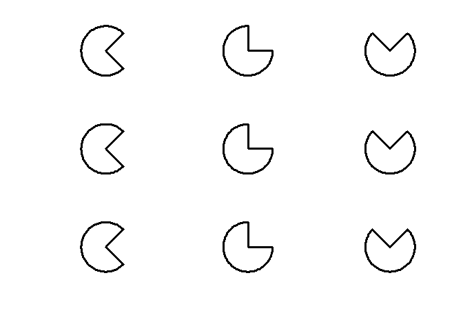
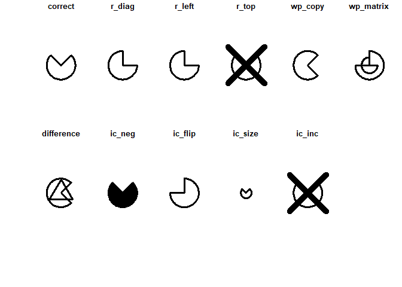
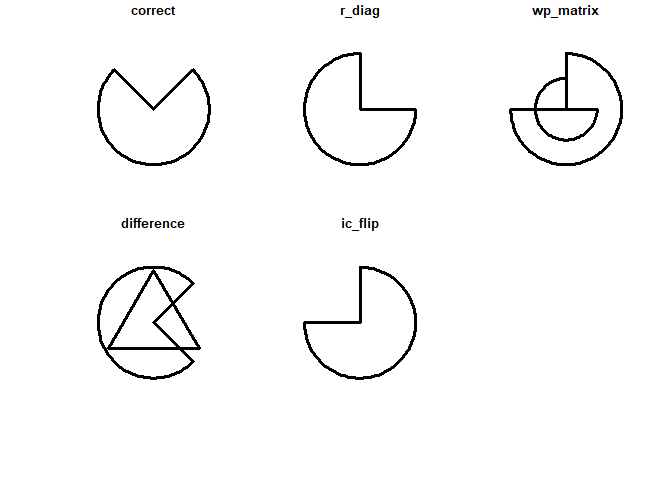

<!-- README.md is generated from README.Rmd. Please edit that file -->

# matRiks

<!-- badges: start -->
<!-- badges: end -->

The goal of `matRiks` is to generate Raven-like stimuli according to
rules. This package has been developed by Dr. Andrea Brancaccio and
Dr. Ottavia M. Epifania.

## What it does

The `matRiks` package is a convenient tool for generating Raven-like
stimuli according to both logical rules (i.e., the relationships between
the elements in the matrix are manipulated to create the matrix) and
visuospatial rules (i.e., the visual or spatial characteristics of the
elements are manipulated to generate the matrix). The response list
associated with each matrix is generated as well, containing 11 response
options (i.e., one correct response and 10 distractors) among which the
users can choose the most apt for their aims. The distractors are bound
to both the rules and the directional logic that have been used for
generating the matrix. As such, not all the distractors can be generated
for all the matrices. In case a distractor can not be generated for a
given matrix, a warning is thrown and the distractors is covered by a
thick black X.

## Installation

You can install the development version of matRiks from
[GitHub](https://github.com/) with:

``` r
# install.packages("devtools")
devtools::install_github("OttaviaE/matRiks")
```

## Example

This code provides an example on how to generate a basic matriks by
using one figure (`pacman()`) and manipulating its rotation (`rotate`)
horizontally:

``` r
library(matRiks)
#> Warning: il pacchetto 'matRiks' è stato creato con R versione 4.3.2
#> 
#> Caricamento pacchetto: 'matRiks'
#> Il seguente oggetto è mascherato da 'package:methods':
#> 
#>     show
#> I seguenti oggetti sono mascherati da 'package:base':
#> 
#>     identity, replace
## Generate a simple matriks by horizontally rotating a pacman
my_mat <- mat_apply(pacman(), hrules = "rotate")
# draw the matriks 
draw(my_mat)
```



Along with the matriks, its associated response list can be generated as
well:

``` r
# generate the response list
responses <- response_list(my_mat)
#> Warning in repetition.matriks(obj): R-Top is equal to the correct response
#> Warning in ic_inc.matriks(obj): IC-Inc cannot be obtained with a single figure
# draw the response list and print the title of the distractors
draw(responses, main = TRUE)
```



Since two distractors cannot be generated given the rule and the
directional logic used for generating the matriks, two warnings are
thrown and the related distractors are crossed out by a thick black X.

This code print a small selection of distractors:

``` r
draw(responses, main = TRUE, distractors = c("correct", "r_diag", "wp_matrix", "difference", "ic_flip"))
```


